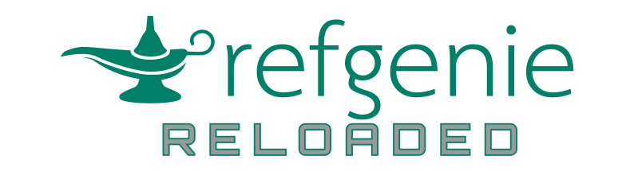

<p align="center"></p>

<h2 align="center">Reference genome management, rebuilt from the ground up</h2>

Refgenie has been completely rewritten with a modern architecture designed for reproducibility, scalability, and GA4GH compatibility.


## Refgenie legacy

<div id="refgenie-stats" style="display:flex; gap:1.5rem; margin:1.5rem 0;">
  <div style="flex:1; text-align:center; background:#f8f9fa; border:1px solid #dee2e6; border-radius:0.75rem; padding:1.5rem;">
    <div id="stat-bytes" style="font-size:2.5rem; font-weight:700; color:#1a73e8;">...</div>
    <div style="font-size:0.85rem; color:#666; margin-top:0.25rem;">TOTAL DATA SERVED</div>
  </div>
  <div style="flex:1; text-align:center; background:#f8f9fa; border:1px solid #dee2e6; border-radius:0.75rem; padding:1.5rem;">
    <div id="stat-requests" style="font-size:2.5rem; font-weight:700; color:#1a73e8;">...</div>
    <div style="font-size:0.85rem; color:#666; margin-top:0.25rem;">TOTAL REQUESTS SERVED</div>
  </div>
</div>

<script>
fetch('https://stats.databio.org/stats/aws/summary.json')
  .then(r => r.json())
  .then(d => {
    document.getElementById('stat-bytes').textContent = (d.BytesDownloaded / 1e12).toFixed(1) + ' TB';
    document.getElementById('stat-requests').textContent = (d.AllRequests / 1e6).toFixed(1) + ' million';
  });
</script>


## What's new

- **Custom recipes and assets** — Define your own recipes and asset classes and publish them as a data channel on any web host, no changes to core refgenie required. Previously these were hardcoded in the codebase.
- **Cloud-friendly asset retrieval** — Pull individual asset files directly from their own URLs, including straight from cloud storage, instead of downloading a whole `.tgz` archive to get one file.
- **Upgraded genome identifiers** — Genomes and sequences are identified by their GA4GH content digest, with human-readable aliases like `hg38` on top. Identity is reproducible and identical sequences are stored only once.
- **Local dashboard** — Run `refgenie dash` to browse your genomes, aliases, and assets (including remote assets from subscribed servers) in a local web app, no server to deploy.
- **AI-assistant access** — Point Claude at refgenie's built-in MCP server and ask about your assets in plain language; it reads your local database, read-only.
- **Standards-based interoperability** — Fetch assets through standard GA4GH DRS endpoints, so any DRS-aware workflow tool can consume them directly.
- **Direct sequence retrieval** — Pull a sequence or subsequence straight out of the store with `refgenie getseq`, no FASTA file on disk required.

## Quick start

```console
pip install refgenie

refgenie --help
```

## Documentation

Head to the [**Refgenie**](refgenie/README.md) tab for full documentation, including installation, tutorials, and how-to guides.

Looking for the refget Python package? See the [**Refget**](refget/README.md) tab.

!!! note "Upgrading from pre-1.0?"
    Documentation for the original refgenie and refgenie server is available in the [**Legacy**](legacy/README.md) tab.


                                                                                                                                                                                           
  ## Refgenie server usage                                                                                                                                                                       
                                                                                                 